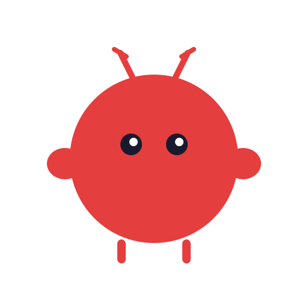
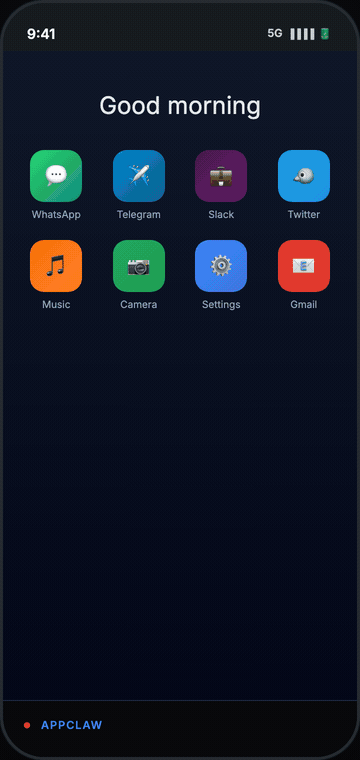

<p align="center">
  
</p>

<h1 align="center">AppClaw</h1>

<p align="center">AI-powered mobile automation agent for Android and iOS. Tell it what to do in plain English — it figures out what to tap, type, and swipe.</p>

<table align="center">
<tr>
<td valign="middle" align="center">



</td>
<td valign="middle">

```
You: "Send a WhatsApp message to Mom
      saying good morning"

AppClaw:
  Step 1: Open WhatsApp
  Step 2: Search for Mom
  Step 3: Open chat with Mom
  Step 4: Type "good morning"
  Step 5: Tap Send
  Step 6: Done

  ✅ Goal completed in 6 steps.
```

</td>
</tr>
</table>

## Prerequisites

1. **Node.js** 18+
2. **Device connected** — USB, emulator, or simulator
3. **LLM API key** from any supported provider (Anthropic, OpenAI, Google, Groq, or local Ollama)

## Installation

### From npm

```bash
npm install -g appclaw
```

Create a `.env` file in your working directory:

```bash
cp .env.example .env
```

### Local development

```bash
git clone https://github.com/AppiumTestDistribution/appclaw.git
cd appclaw
npm install
cp .env.example .env
```

Edit `.env` based on your preferred mode:

<details>
<summary><strong>Vision + Stark (recommended)</strong></summary>

Screenshot-first mode using Stark (df-vision + Gemini) for element location. Requires a Gemini API key.

```env
LLM_PROVIDER=gemini
LLM_API_KEY=your-gemini-api-key
LLM_MODEL=gemini-3.1-flash-lite-preview
AGENT_MODE=vision
VISION_LOCATE_PROVIDER=stark
```

</details>

<details>
<summary><strong>Vision + Appium MCP</strong></summary>

Screenshot-first mode using appium-mcp's server-side AI vision for element location. See [appium-mcp AI Vision setup](https://github.com/appium/appium-mcp?tab=readme-ov-file#ai-vision-element-finding) for details.

```env
LLM_PROVIDER=gemini
LLM_API_KEY=your-gemini-api-key
LLM_MODEL=gemini-3.1-flash-lite-preview
AGENT_MODE=vision
VISION_LOCATE_PROVIDER=appium_mcp
AI_VISION_ENABLED=true
AI_VISION_API_BASE_URL=https://generativelanguage.googleapis.com/v1beta/openai
AI_VISION_API_KEY=your-vision-api-key
AI_VISION_MODEL=gemini-2.0-flash
```

</details>

<details>
<summary><strong>DOM mode</strong></summary>

Uses XML page source to find elements by accessibility ID, xpath, etc. No vision needed — works with any LLM provider.

```env
LLM_PROVIDER=gemini            # or anthropic, openai, groq, ollama
LLM_API_KEY=your-api-key
AGENT_MODE=dom
```

</details>

## Usage

### Agent mode (LLM-driven)

```bash
# Interactive mode
appclaw

# Pass goal directly
appclaw "Open Settings"
appclaw "Search for cats on YouTube"
appclaw "Turn on WiFi"
appclaw "Send hello on WhatsApp to Mom"

# Or with npx (no global install)
npx appclaw "Open Settings"
```

When running from a local clone, use `npm start` instead:

```bash
npm start
npm start "Open Settings"
```

### YAML flows (no LLM needed)

Run declarative automation steps from a YAML file — fast, repeatable, zero LLM cost:

```bash
appclaw --flow examples/flows/google-search.yaml
```

Flows support both structured and natural language syntax:

**Structured:**
```yaml
appId: com.android.settings
name: Turn on WiFi
---
- launchApp
- wait: 2
- tap: "Connections"
- tap: "Wi-Fi"
- done: "Wi-Fi turned on"
```

**Natural language:**
```yaml
name: YouTube search
---
- open YouTube app
- click on search icon
- type "Appium 3.0" in the search bar
- perform search
- scroll down until "TestMu AI" is visible
- done
```

Supported natural language patterns include: `open <app>`, `click/tap <element>`, `type "text"`, `scroll up/down`, `swipe left/right`, `wait N seconds`, `go back`, `press home`, `assert "text" is visible`, `press enter`, and `done`.

### Playground (interactive REPL)

Build YAML flows interactively on a real device — type commands and watch them execute live:

```bash
appclaw --playground
```

Features:
- Type natural-language commands that execute immediately on the device
- Steps accumulate as you go
- Export to a YAML flow file anytime
- Slash commands: `/help`, `/steps`, `/export`, `/clear`, `/device`, `/disconnect`

### Explorer (PRD-driven test generation)

Generate YAML test flows from a PRD or app description — the explorer analyzes the document, optionally crawls the app on-device, and outputs ready-to-run flows:

```bash
# From a text description
appclaw --explore "YouTube app with search and playback" --num-flows 5

# From a PRD file, skip device crawling
appclaw --explore prd.txt --num-flows 3 --no-crawl

# Full options
appclaw --explore "Settings app" --num-flows 10 --output-dir my-flows --max-screens 15 --max-depth 4
```

### Record & replay

```bash
# Record a goal execution
appclaw --record "Open Settings"

# Replay a recording (adaptive — reads screen, not coordinates)
appclaw --replay logs/recording-xyz.json
```

### Goal decomposition

```bash
# Break complex multi-app goals into sub-goals
appclaw --plan "Copy the weather and send it on Slack"
```

## Configuration

All configuration is via `.env`:

| Variable | Default | Description |
|---|---|---|
| `LLM_PROVIDER` | `gemini` | LLM provider (`anthropic`, `openai`, `gemini`, `groq`, `ollama`) |
| `LLM_API_KEY` | — | API key for your provider |
| `LLM_MODEL` | (auto) | Model override (e.g. `gemini-2.0-flash`, `claude-sonnet-4-20250514`) |
| `AGENT_MODE` | `vision` | `dom` (XML locators) or `vision` (screenshot-first) |
| `VISION_LOCATE_PROVIDER` | `stark` | Vision backend for locating elements (`stark` or `appium_mcp`) |
| `MAX_STEPS` | `30` | Max steps per goal |
| `STEP_DELAY` | `500` | Milliseconds between steps |
| `LLM_THINKING` | `off` | Extended thinking/reasoning (`on` or `off`) |
| `LLM_THINKING_BUDGET` | `1024` | Token budget for extended thinking |
| `SHOW_TOKEN_USAGE` | `false` | Print token usage and cost per step |

## How It Works

Each step, AppClaw:
1. **Perceives** — reads the device screen (UI elements or screenshot)
2. **Reasons** — sends the goal + screen state to an LLM, which decides the next action
3. **Acts** — executes the action (tap, type, swipe, launch app, etc.)
4. **Repeats** until the goal is complete or max steps reached

### Agent Actions

| Action | Description |
|---|---|
| `tap` | Tap an element |
| `type` | Type text into an input |
| `scroll` / `swipe` | Scroll or swipe gesture |
| `launch` | Open an app |
| `back` / `home` | Navigation buttons |
| `long_press` / `double_tap` | Touch gestures |
| `find_and_tap` | Scroll to find, then tap |
| `ask_user` | Pause for user input (OTP, CAPTCHA) |
| `done` | Goal complete |

### Failure Recovery

| Mechanism | What it does |
|---|---|
| **Stuck detection** | Detects repeated screens/actions, injects recovery hints |
| **Checkpointing** | Saves known-good states for rollback |
| **Human-in-the-loop** | Pauses for OTP, CAPTCHA, or ambiguous choices |
| **Action retry** | Feeds failures back to the LLM for re-planning |

## CLI Reference

```
Usage: appclaw [options] [goal]

Options:
  --help              Show help message
  --version           Show version number
  --flow <file.yaml>  Run declarative YAML steps (no LLM needed)
  --playground        Interactive REPL to build YAML flows step-by-step
  --explore <prd>     Generate test flows from a PRD or description
  --num-flows <N>     Number of flows to generate (default: 5)
  --no-crawl          Skip device crawling (PRD-only generation)
  --output-dir <dir>  Output directory for generated flows
  --max-screens <N>   Max screens to crawl (default: 10)
  --max-depth <N>     Max navigation depth (default: 3)
  --record            Record goal execution for replay
  --replay <file>     Replay a recorded session
  --plan              Decompose complex goals into sub-goals
```

## License

Licensed under the Apache License, Version 2.0. See `LICENSE` for the full text.
